## Q1.

Your NetFlow collector is not working due to a large amount of traffic entering your network which is destined to a single IP address. Which NetFlow feature allows you to collect the top source 

hosts for this traffic on the local router?

A.	A NetFlow can export flows only to an external flow collector

B.	show ip cache flow

C.	ip accounting

D.	ip flow top-talkers

Answer: D


## Q2. 

When you implement PfR, which IP SLA probe is used to determine the MOS?

A.	jitter

B.	latency

C.	packet loss

D.	throughput

Answer: A


## Q3.

Which statement about Type 4 LSA in OSPFv2 is true?

A. It is present only in the backbone area.

B. It is generated by each ABR and forwarded in non-stub areas.

C. It is forwarded in NSSA areas.

D. It is generated by the ASBR and forwarded throughout the whole OSPF domain

Answer: B

Usefull link : http://packetlife.net/blog/2008/apr/21/where-are-type-4-lsas-generated/


## Q4.

Which three technologies can be used to implement redundancy for IPv6? (Choose three)

A. IPv6 NA

B. NHRP

C. HSRP

D. DVMRP

E. GLBP

F. IPv6 RA

Answer: CEF


## Q5.

On a network using DiffServ, which option refers to the actions that applied to a packet as it moves through the network?

A. DSCP

B. PHB

C. Codepoint

D. IP-precedence

Answer: B

 Usefull Link:  https://www.cisco.com/en/US/technologies/tk543/tk766/technologies_white_paper09186a00800a3e2f.html


## Q6.



Refer to the exhibit. R1 is unable to ping the device at 10.3.3.3. Which two options are possible reasons for the problem? (Choose two.)

A. The static route is configured as a host route.

B. The static route points to a broadcast interface without a n

C. IP CEF is disabled on the local router.

D. Proxy ARP is disabled on the next-hop router.

E. The dynamic routing protocol configuration is missing. 

F. IP CEF is disabled on the  remote router.

Answer: BD

Explanation: The problem with configuring a broadcast interface as next-hop is that in the absence of a next-hop address, the router will issue an ARP request for the destination IP 10.3.3.3 - you can see that being done in the ARP debug in the exhibit.  The only way that could work for a non-connected prefix is if an attached router with a known route to that subnet had proxy-ARP configured, in which case it would reply to the ARP request with its own information and forward the packet on.  I've seen this one in production.


## Q7.

Which two statements about the host address 10.88.100.10/13 are true? (Choose two)

A. The network address is 10.64.0. 0

B. The broadcast address is 10.95.255.255

C. The network address is 10.88.0.0

D. The broadcast address is 10.6 4.255.255

E. The broadcast address is 10.88.255.255

F . The network address is 10.88. 100.0

Answer: BC


## Q8.



Refer to the exhibit. Which two statements are true? (Choose two.) 

A. This is the output of the  show ip ospf command.

B. This is the output of the show ip protocols command.

C. This router is an ABR. 

D. This router is an ASBR.

E. Authentication is not configured for the area.

Answer: AE


## Q9.

How are the Cisco Express Forwarding table and the FIB related to each other?

A. The FIB is used to populate the Cisco Express Forwarding table.

B. The Cisco Express Forwarding table allows route lookups to be forwarded to the route processor for processing before they are

C. There can be only one FIB but multiple Cisco Express Forwarding tables on 10S devices.

D. Cisco Express Forwarding uses a FIB to make IP destination prefix-based switching decisions.

Answer: D


## Q10.

Which  action does route poisoning take that serves as a  loop-prevention method?

A. It immediately sends routing updates with an unreachable metric to all devices.

B. It prohibits a router from advertising back onto the interface from which it was learned.

C. It advertises a route with an unreachable metric back onto the interface from which it was learned.

D. It poisons the route by t agging it uniquely within the network

Answer: A


## Q11.

Which two statements about AAA  authentication are true? (Choose  two)

A. RADIUS authentication queries the router's local username database.

B. TACASCS+ authentication uses an RSA server to authenticate users.

C. Local user names are case-insensitive.

D. Local authentication is maintained on the router.

E. KRB5 authentication disables user access when an incorrect password is entered

Answer: DE

Usefull link : https://supportforums.cisco.com/t5/other-network-infrastructure/username-case-sensitivity/td-p/21761

## Q12.

Which OpenStack component implements role-based access control?

A. Horizon

B. Nova

C. Neutron

D. Keystone

Answer: D


## Q13.

Which IPv6 tunneling method allows Host A to communicate with Host B within the same site?

A. I SA TAP

B. 6to4

C. GRE

D. Manual

Answer: A


## Q14.



Refer to the exhibit. Which data format is used in this REST API call?

A. XML

B. BASH 

C. JSON 

D. HTML

E. HTMLv5

Answer: C


## Q15.

When the BGP additional-paths feature is used, what allows a BGP speaker to differentiate between the different available paths?

A. The remote BGP peer prepends its own next-hop address to the prefix.

B. A unique path identifier is encoded into a dedicated field to the NLR I.

C. A route distinguisher is appended to the prefix by the receiving BGP speaker.

D. The additional path information is encoded in an extended community

Answer B

  


## Q16.

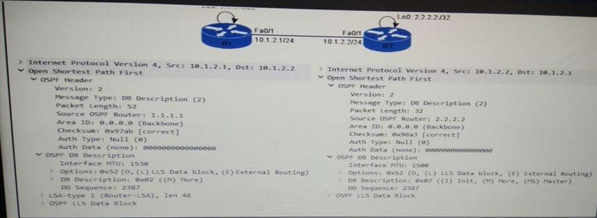


Refer to the exhibit. Which two statements about the 192.168.23.0/24 prefix are true ? (Choose two.)

A. Router 192.168.45.4 cannot act as a feasible successor.

B. Router 192.168.35.3 is the only successor.

C. Only router 192.168.45.4 is a feasible successor.

D. Routers 192.168.35.3 and 192. 168. 45.4 are successors.

E. Routers 192.168.35.3 a nd 192. 168.45.4 are feasible successors.

F. Only router 192. 168.35.3 is a feasible successor.

Answer: AB

 


## Q17.

In a DMVPN solution, which component can the GRE tunnel source and destination generate automatically?

A. pre-shared keys

B. crypto ACLs

C. QoS markings

D. policy maps

Answer: B


## Q18.

Which IGMP snooping feature tracks IGMPv3 hosts on a per-port basis?

A. IGMPv3 querier

B. IGMPv3 static-group

C. fast-leave

D. explicit tracking

E. membership report

Answer: A

  


## Q19.

Which two options are the two main phases of PPPoE? (Choose two.)

A. Active Discovery Phase

B. IKE Phase

C. Main Mode Phase

D. PPP Session Phase

E. Aggressive Mode Phase

F. Negotiation Phase

Answer: AD


## Q20.

If EIGRP and OSPF are configured within an administrative domain for the same network, which value can you change so that the OSPF becomes the installed routing protocol for all routes?

A. Local preference

B. Metric

C. MED

D. Administrative distance

E. Prefix length

Answer: D


## Q21.

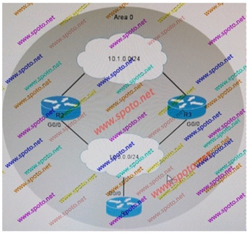


Refer to the exhibit. R1 has c1n OSPF path to R2 and R3 for 10.1.0.0/24, but R1 has a routing entry for 10. 1.0.0/24 from only one router at a time. Which option is the most likely cause?

A. The R1 maximum-path is set to 1.

B. R2 has a higher administrative distance.

C. R2 is using a filter list.

D. R2 is using an offset-list.

Answer: A


## Q22.

What value does MAC Authentication Bypass use, by default, for the password attribute in its RADIUS Access-Request message ?

A. The MAC address of the switch

B. The password learned from the EAP Response

C. The MAC address of the endpoint to be authenticated

D. The password supplied for the RADIUS server.

Answer: C

  


## Q23.

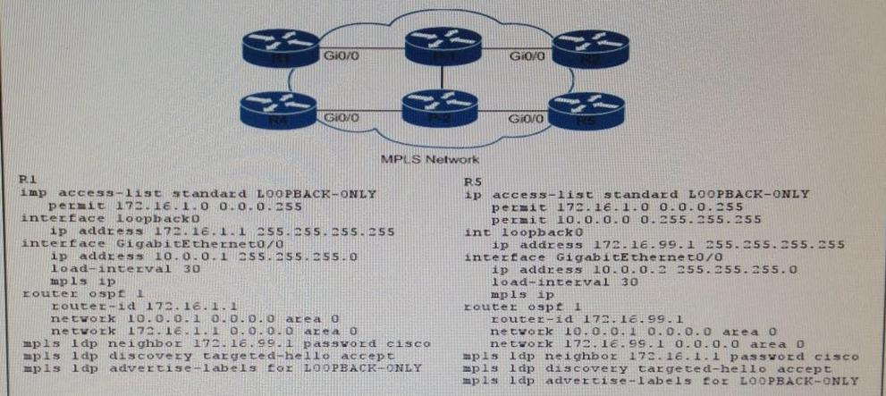


Refer to the exhibit. When traffic marked as CoS 5 arrives on the switch, what DSCP value does the switch apply?

A. 0

B. 32

C. 40

D. 46

E. 48

Answer: B


## Q24.

Which two statements about PPP PAP are true? (Choose  two) 

A. It requires two-way authentication.

B. It can protect against playback attacks.

C. It is supported only on synchronous interfaces.

D. It is vulnerable to trial-and error attacks.

E. Login attempts are control led by the remote node

Answer: DE

 


## Q25.

Which three of the following security controls would you take into consideration when implementing loT capabilities? (Choose three.)

A. Layered Security Approach.

B. Place security above functionality.

C. Define lifecycle controls for loT devices.

D. Privacy impact Assessment.

E. Change passwords every 90 days.

F. Implement Intrusion Detection Systems on loT devices.

Answer: ACD


## Q26.



Refer to the exhibit. An lpv6 tunnel is configured between site A and site B. Which feature does the tunnel support?

A. single policy

B. transport mode

C. site-to-site tunnel mode

D. OSPFv2

Answer: C

  


## Q27.

Which two statements about 6PE are true? (choose two)

A. iBGP peering between the PE routers should be done using an IPv6 address.

B. It does not require MPLS between the PE routers.

C. It requires a VRF on the IPv6 interface

D. It requires BGP to exchange labeled IPv6 unicast between PE routers

E. Uses an IPv4-mapped IPv6 address as the IPv4 next-hop o n PE router

Answer: DE

 


## Q28.

Which two statements about IPv4 and IPv6 networks are true? (Choose two.)

A. In IPv6, hosts perform fragmentation.

B. IPv6 uses a UDP checksum to verify packet integrity.

C. In IPv6, routers perform fragmentation.

D. In IPv4, fragmentation is performed by the source of the packet.

E. IPv4 uses an optional checksum at the transport layer.

F. IPv6 uses a required checksum at the network layer.

Answer: AB


## Q29.

Which description of Infrastructure as a Service is true?

A. a cloud service that delivers on-demand intranet connection between sites

B. a cloud service that delivers on-demand software seNices on a subscription basis

C. a cloud service that delivers on-demand internet connection between sites

D. a cloud service that delivers on-demand resources like networking and storage

Answer: D


## Q30.



Refer to the exhibit. According to the given show line output, which type of line is connected to the router?

A. Telnet

B. terminal

C. console

D. SSH

E. auxiliary

Answer: C

  


## Q31.

Which IP SLA operation type is enhanced by the use of the  IP SLAs Responder?

A. DNS

B.HTTP

C. ICMP Echo

D. UDP Echo

Answer: D

   


## Q32.



Refer to the exhibit. With BGP always compare-med enabled, which BGP entry is installed in the RIB?

A. Entry 1 because it was installed first (oldest) in the BGP table.

B. Entry 1 because it has the best MED of the external routes.

C. Entry 2 because it has the lowest router ID.

D. Entry 3 because it has the lowest MED.

Answer: D


## Q33.

Which statement about a Cisco APIC controller versus a more traditional SDN controller is true?

A. APIC uses a policy agent to translate policies into instructions.

B. APIC supports OpFlex as a Northbound protocol.

C. APIC does support a Southbound REST API

D. APIC uses an imperative model

Answer: A


## Q34.

Which two statements about CEF polarization are true? (Choose two)

A. The AND operation is performed on the higher-order bits of the source and destination IP address

B. A single link is chosen for all flows

C. The AND operation is performed on the lower-order bits of the source and destination IP address

D. After the XOR process, the flow is processed in the distribution Layer with a different hashing algorithm

E. It can be prevented by alternating the hashing inputs

F. When enabled, it allows all links to be used efficiently for different traffic flows

Answer: BE


## Q35. 



Refer to the exhibit. Which two route types are advertised  by a router with this configuration? (Choose two)

A. static

B. summary

C. connected

D. redistributed

E. external

Answer: BC


## Q36.

With which protocol is CoAP designed to be used?

A. TCP

B. SNMP

C. UDP

D. XMPP

Answer: C


## Q37.



Refer to the exhibit. Which statement describes what the authoritative flag indicates?

A. Authentication was used for the mapping.

B. R1 learned about the NHRP mapping from a registration request.

C. Duplicate mapping in the NHRP cache is prevented.

D. The registration request had the same flag set.

Answer: B


## Q38.

Which two statements about VRF lite  are  true? (Choose two)

A. An isolated VRF routing table is created for each VR F.

B. A single customer VRF can support overlapping IP addresses

C. Multiple ISP customers can be supported on one customer edge device.

D. Two or more VRFs can be assigned to a single Layer 3 interface

E. At least one physical interface must be configured to enable a VRF

Answer: AB

 


## Q39. 

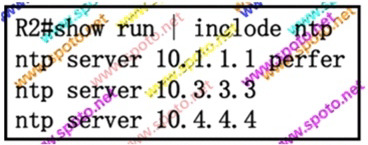


Refer to the exhibit. If the route to 10.1.1.1 is removed from the R2 routing table, which server becomes the master NTP server?

A. R2

B. the NTP server at 10.3.3.3

C. the NTP server at 10.4.4.4

D. the NTP server with the lowest stratum number

Answer: D


## Q40. 

Which two statements about EIGRP load balancing are true? (Choose two.)

A. EIGRP supports 6 unequal-cost paths.

B. A path can be used for load balancing only if it is a feasible successor.

C. E IGRP supports unequal-cost paths by default.

D. Any path in the EIGRP topology table can be used for unequal-cost load balancing.

E. Cisco Express Forwarding is required to load-balance across interfaces.

Answer: AB


## Q41.

Which two statements about 802.1Q tunneling are true? (Choose two.)

A. It requires a system MTU of at least 1504 bytes.

B. The default configuration sends Cisco Discovery Protocol, STP, and VTP information.

C. Traffic that traverses the tunnel is encrypted.

D. It is supported on private VLA N ports.

E. MAC-based QoS and UDL D are supported on tunnel ports.

F. Its maximum allowable system MTU is 1546 bytes.

Answer: AE


## Q42.

Which two methods can you use to limit the range for EIGRP queries? (Choose two.)

A. Use an access list to deny the multicast address 224. 0.0. 1 outbound from select E IGRP neighbor and permit everything else.

B. Configure route tagging for all EIGRP routes.

C. Summarize routes at the boundary routers of the EIGRP domain.

D. Configure unicast EIGRP on all routers in the EIGRP domain.

E. Configure stub routers in the EIGRP domain.

F. Use an access list to deny the multicast address 224. 0.0.10 outbound from select EIGRP neighbors and permit everything else.

Answer: CE


## Q43.

Which command address learning on the configures port security on a switch to enable permanent MAC interface?

A. switchport port-security mac-address-learning enable

B. switchport port-security mac-address timer 0

C. switchport port-security mac-address sticky

D. switchport port-security mac-address maximum 1 sticky

E. switchport port-security mac-address permanent

Answer C

  


## Q44.

Which three values are used to generate a unique bridge ID for each VLAN in PVST+? (Choose three)

A. port cost

B. max age

C. spanning-tree MAC address

D. port priority

E. switch priority

F. extended system ID

Answer: CEF


## Q45.

Which three criteria are used for stackwise election of a master switch?

A. VLAN revision number

B. longest uptime

C. highest MAC address

D. user-selected priority

E. 10S version number

F. lowest MAC address

Answer: BDF


## Q46. 

Which three statements are true about PPP CHAP authentication? (Choose three.)

A. PPP encapsulation must be enabled globally.

B. The LCP phase must b,e complete and in closed state.

C. The hostname used by a router for CHAP authentication cannot be changed.

D . PPP encapsulation must be enabled on the interface.

E. The LCP .phase must bJ e complete and in open state.

F. By default, the router uses its hostname to identify itself to the peer

Answer: DEF


## Q47.

Which two features are incompatible with Loop Guard on a port? (Choose two.)

A. Root Guard

B. PortFast

C. UplinkFast

D. BackboneFast

E. BPDU skew detection

Answer: AB


## Q48. 

Which IPv6 firsthop security feature blocks traffic sourced from IPv6 addresses that are outside the prefix gleaned from router advertisements?

A. IPv6 RA guard

B. IPv6 DHCP guard

C. IPv6 source guard

D. IPv6 prefix guard

Answer: D

  


## Q49. 

Which command can you enter on an interface so that the interface will notify the sender of a packet that the packet that the path is suboptimal?

A. ip nhrp record

B. ip nhrp set-unique-bit

C. ip nhrp shortcut

D. ip nhrp redirect

E. ip nhrp cost 65535

Answer: D

  


## Q50.

Which two statements about MLD snooping are true? (Choose two)

A. MLD protocol messages can be sent in both IGMPv4 and ICMPv6 formats.

B. It supports private VLA Ns.

C. It limits the Layer 2 multicast traffic that is generated by routing protocols.

D. The MLD snooping querier requires the VLAN interface to be configured with an 1Pv6 address.

E. PFC modes support MLD version 2 only.

Answer: BD


## Q51.

Which effect of configuring the passive-interface SOJO  command under the EIGRP routing process is true?

A. It prevents EIGRP neighbor relationships from being formed over interface SOJO.

B. It configures interface SOJO to send hello packets with the passive-interface bit set.

C. It configures interface S0/0 to suppress all outgoing routing updates.

D. It configures interface S0/0 to reject all incoming routing updates

Answer: A

  


## Q52.

Which action can you take to avoid suboptimal routing on an EIGRP network?

A. Use tags to filter routes outbound.

B. Use the distribute-list command to filter routes inbound.

C. Summarize outbound prefixes.

D. Redistribute connected and static routes.

Answer: D


## Q53.

What is the modified EUI-64 value corresponding to MAC address 0032.F4C5.7781 as used in IPv6?

A. FFFE.0032.F4C5.7781

B. C577.81 FF.FE00.32F4

C. 0032.F4C5.7781.FFFE

D. 0032.F4FF.FEC5.7781

Answer: D


## Q54.



Refer to the exhibit. This router is advertising which routes via BGP?

A. no routes

B. BGP routes that originated from AS 65006 and BGP routes that originated on this router

C. all routes 

D. BGP routers sourced on this router

E. all BGP routes from AS 65006

Answer: B


## Q55.

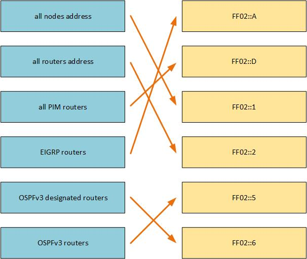

Refer  to the exhibit. Which two statements about this capture are true? (Choose two.)

A. It is set to run for five minutes.

B. It continues to capture data after the buffer is full.

C. It is set to run for a period of 00:03:26.

D. It captures data only until the buffer is full.

E. It is set to use the default buffer type.

Answer: AB


## Q56.

How is the TCAM on a Catalyst switch used when VRF-Lite is configured?

A. Each configured routing protocol receives its own Layer 3 TCAM

B. Each configured VRF receives its own Layer 3 TCAM

C. Layer 3 TCAM is not used in VRF-Lite configurations.

D. All configured VRFs share the Layer 3 TCAM

Answer: D


## Q57.

Which  two statements are true  about VPLS? (Choose two.)

A. It can work over any transport that can forward IP packets.

B. It provides integrated mechanisms to maintain First Hop Resiliency Protocols such as HSRP, VRRP, or GLBP.

C. It includes automatic detection of multihoming.

D. It relies on flooding to propagate MAC address reachability information.

E. It can carry a single VLAN per VPLS instance

Answer: DE


## Q58.

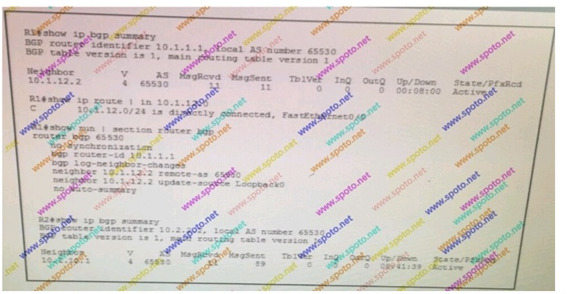


Refer to the exhibit. R1 and R2 have been configured as BGP neighbor, but their session is stuck in active. Which action can you take that will enable a session to be established?

A. Enable synchronization on R 1 and R2.

B. Issue the neighbor 1 0.1.12.2 activate command on R 1.

C. Configure 10.1.12.1 as the BGP router ID on R 1

D. Configure a neighbor relationship with Loopback0 address of R1 on R2

Answer: D


## Q59.

Which two events occur when a packet is decapsulated in a GRE tunnel? (Choose two.)

A. The destination IPv4 address in the IPv4 payload is used to forward the packet.

B. The TTL of the payload packet is decremented.

C. The source IPv4 address in the 1Pv4 payload is used to forward the packet.

D. The TT L of the payload packet is incremented.

E. The version field in the 1GRE header is incremented.

F . The GRE keepalive mechanism is reset.

Answer: AB


## Q60.

```

https://mydevice.mycompanycom/getstuff?queryName=error&queryResults=yes

```


Refer to the exhibit. Which network script automation option or tool is used in the exhibit?

A. EEM

B. Python

C. Bash script

D. NETCONF

E. REST

Answer: E


## Q61.

Which two conditions must be met before IS-IS Level 1 routers will become adjacent? (Choose two.)

A. The routers must share a common Autonomous System Number.

B. The router must share a common process ID.

C. The router must be in different areas.

D. The routers must share a common network segment.

E. The routers must be configured with the neighbor command.

F. The routers must be in the same area.

Answer: DF


## Q62.

Which two options are interface requirements for turbo flooding? (Choose two.)

A. The interface is Ethernet.

B. The interface is configured for ARPA encapsulation.

C. The interface is PPP.

D. The interface is configured for GRE encapsulation.

E. The interface is configured for 802.1 Q encapsulation.

Answer: AB


## Q63.

Which two options are purposes of MSDP SA filtering? (Choose two.)

A. to allow the filtering of PIM messages between peers

B. to allow all SA message to be processed by MSDP peers

C. to improve the scalability of an MSDP multicast environment

D. to reduce the number of multicast address that are shared to MSDP peers

E. to allow the filtering of IGMP messages between peers

F. to reduce the number of multicast address that are distributed to other devices in the same multicast domain

Answer: CD


## Q64.

Which statement about route summarization is true?

A. EIGRP can summarize routes at the classful network boundary

B. EIGRP and RIPv2 route summarize are configured with the ip summary-address command under the route process.

C. It can be disabled in RIP, RIPv2 and EIGRP

D. RIPv2 can summarize-routes beyond the classful network boundary

Answer: A


## Q65.

Which option is an example of SaaS?

A. Microsoft Azure

B. Google Apps

C. Amazon AWS

D. Google App Engine

Answer: B


## Q66.

Which  statements about PMTUD is true?

A. It is supported by TCP and UDP.

B. It increases the connection's send MSS value to prevent fragmentation.

C. GRE tunnels use PMTUD to fragment data packets by default.

D. It is used to prevent fragmentation of packets at the endpoint of a TCP connection.

E. It is used to prevent fragmentation of packets traveling across a smaller MTU link between two endpoints.

Answer: A

   


## Q67.

Which two statements about IS-IS metrics are true? (Choose two)

A. The default metric style is narrow

B. The default metric for the IS-IS interface is 63

C. The default metric style is wide

D. The default metric for the IS-IS interface is 64

E. The default metric for the IS-IS interface is 10

Answer: AE


## Q68.

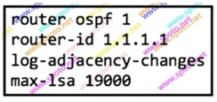 


Refer to the exhibit. Which statement about the functionality of this configuration is true?

A. The router does not accept nonself-generated LSAs once a maximum of 19000 is reached, unless the router is an ABR

B. The router does not accept nonself-generated LSAs once a maximum of 19000 is reached

C. The router does not accept nonself-generated LSAs once a maximum of 19000 is reached, unless the router is in area 0

D. The router does not accept nonself-generated LSAs once a maximum of 19000 is reached, unless the router is an ASBR

Answer: B


## Q69.

Which statement about STP port states is true?

A. A port in the blocking state remains in that state for 30 seconds before transitioning to the listening state.

B. Listening and learning are transitory port states that use the forward delay timer.

C. When a port transitions to the learning state, it can send and receive data frames.

D. A port in the blocking state learns address and receives BPDUs.

Answer: B


## Q70.

Which information is contained in an OSPF Type 1 Router LSA?

A. The Autonomous System Border Routers(ASBR) for the OSPF network and the cost of the path to reach each ASBR

B. The router's interfaces(links) on which OSPF is enabled, the state and outgoing cost of each link, and the OSPF neighbors on each link

C. The network links to all known OSPF routers and the cost of each path

D. The Area Border Routers (ABR) for the area and the cost of the path to each ABR

E. The OSPF neighboring routers and the cost of the outgoing link to reach each neighbor

Answer B

  


## Q71.

Which type of port would have root guard enabled on it?

A. a root port

B. an alternate port

C. a blocked port

D. a designated port

Answer: D


## Q72.

Which three modes are valid for forming an EtherChannel between the ports of two switches? (Choose three.) 

A. auto/auto

B. desirable/on

C. active/passive

D. auto/desirable

E. passive/passive

F . active/active

Answer: CDF


## Q73.

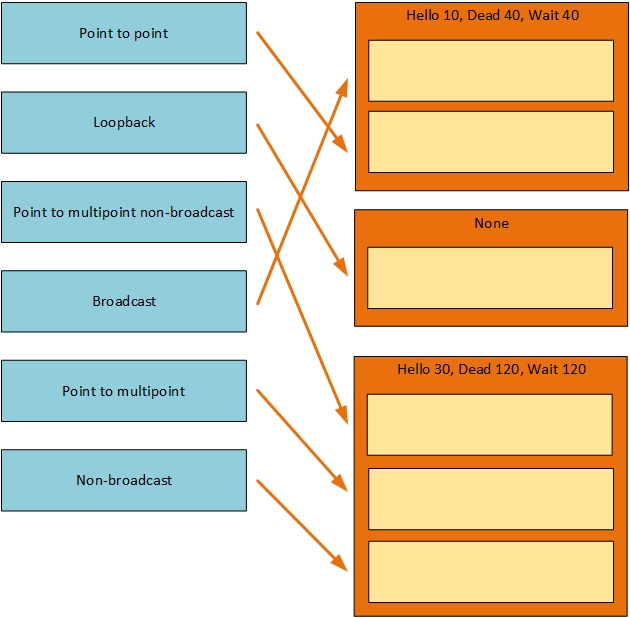


Refer to the exhibit. While troubleshooting a connectivity issue, you executed a traceroute that returned the given output. Which conclusion can you dra>11 about the problem?

A. The PDUs transmitted errors

B. Packets are being fragmented

C. An AGL is blocking traffic

D. The destination is too busy

Answer: D


## Q74.

Which option describes a difference between Ansible and Puppet?

A. Ansible is client-server based, and Puppet is not.

B. Ansible requires an agent, and Puppet does not.

C. Ansible is Python based, and Puppet is Ruby based.

D. Ansible automates repetitive tasks, and Puppet allows you to run plain ssh command

Answer C


## Q75.

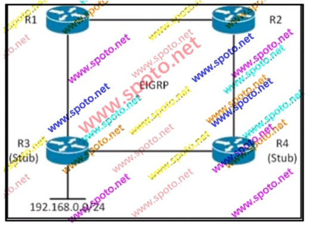


Refer to the exhibit. All routers are running EIGRP and the network has converged. R3 and R4 are configured as EIGRP stub. If the link between R1 and R3 goes down, which statement is true?

A. R1 sends traffic destined to 192.168.0.100 via R2

B. R2 does not have a route to 192.168.0.0/24 in the routing table

C. The prefix 192.168.0.0/24 becomes stuck-in-active

D. R3 does not advertise 192.168.0.0/24 anymore

Answer: B


## Q76.

Which two statements about the passive-interface command  EIGRP  are true? (Choose two)

A. It configures the device to advertise only connected interfaces to neighbors with EIGRP.

B. It configures the interface to use unicast messages to establish EIGRP neighbor relationships.

C. It allows incoming routing updates to be received but disables outgoing routing updates.

D. It disables processing of incoming hello messages.

E. If it is enabled globally under EIGRP on the device, it can be disabled for individual interfaces to allow those interfaces to remain active.

Answer: DE


## Q77.



Refer to the exhibit. After you apply the given configurations to R1 and R2, which networks does R2 advertise to R1?

A. both 172.16.32.0/20 and 172. 16.33.0/24

B. 172.16.32.0/20 only

C. 172.16.0.0/16 only

D. 172.16.33.0/24 only

Answer: C


## Q78.

In  an MPLS VPN environment, what is the effect of configuring  an identical  set of route targets for a particular VRF but then configuring a non identical RD across  multiple PE devices?

A. The routes are rejected by the remote PE because they have a different RD than its routes.

B. The routes are correctly managed by the control plane, but there are instances where routes take up twice as much memory.

C. The routes are not sent to any remote PE with a different RD.

D. The routes propagate to the remote PE, but the PE never installs them in its forwarding table.

Answer: B


## Q79.

Which  two statements about route poisoning are true? (Choose two)

A. It prohibits a route from being advertised out an interface from which it was learned

B. It is supported on RIP, IGRP, and EIGRP networks

C. lt can b e used in conjunction with holddowns to prevent routing loops

D. It is used with distance-vector routing protocols

E. In RIP, a metric of 15 is assigned to the route

Answer: BC


## Q80.

What feature can  a device use to identify other members of the same  IPv6 multicast group on a network segment?

A. MLD

B. MSDP

C. source-specific multicast

D. rendezvous points

Answer: A


## Q81.

Which command can you enter to configure a built in policer with minimum guaranteed bandwidth without starving other classes during periods of congestion?

A.	bandwidth remaining percent

B.	bandwidth

C.	priority percent

D.	fair-queue

Answer: C


## Q82.

Which two options are requirements for Control-Plane Policing? (Choose two.)

A. Cisco Express Forwarding must be enabled globally.

B. Cisco Discovery Protocol must be disabled in the control plane.

C. A crypto policy must be installed.

D. A loopback address must be configured for device access.

E. A class map must be configured to identify traffic.

Answer: AE


## Q83.

Which BGP feature allows a router to maintain its current BGP configuration while it advertises a different AS number to new connections?

A. local-AS

B. next-hop-self

C. allow-AS in

D. soft reset

Answer: A


## Q84.



Refer to the exhibit. Which p art of the joined group addresses list indicates that the interface has joined the EIGRP multicast group address?

A. FF02::1

B. FF02::1:FF00:200

C. FF02::A

D. FF02::2

Answer: C


## Q85.

What is the relationship between NETCONF and YANG?

A. NETCONF uses YANG as a secure transport mechanism

B. NETCONF uses YANG start and end tags to delineate element content

C. NETCONF uses YANG models to define objects and data

D. NETCONF uses YANG messages to communicate with devices

Answer: C


## Q86.

Which three session tables does  NAT64 maintain?

A. 6rd

B. TCP

C. 464XLAT

D. ICMP Query

E. SIP

F. UDP

Answer: BDF


## Q87.

What is the source MAC address of a BPDU frame that is sent out of a port?

A. the lowest MAC address on the switch

B. the highest MAC address on the switch

C. the MAC address of the individual port that is sending the BPDU

D. the same as the MAC address in the bridge ID

Answer: C


## Q88.

When is it most important to implement multiple synonymous area addresses on an IS-IS network?

A. when integrating an IS-IS Layer 2 router with another routing protocol

B. when an IS-IS router is merging routing information

C. when splitting areas in the IS-IS domain

D. when merging or splitting areas in the IS-IS domain

Answer: D


## Q89. 

Which neighbor-discovery message type is used to verify connectivity to a neighbor when the link layer address of the neighbor is known?

A. neighbor solicitation

B. neighbor advertisement

C. router advertisement

D. router solicitation

Answer: A


## Q90.



Refer to the exhibit. Which is true? (Choose two)

A. The priority queue is disabled.

B. Queue 1 is allocated 4 percent of the available bandwidth and queue 2 is allocated 2 percent of the available bandwidth.

C. Queue 1 is a priority queue that is allocated 1 /3 of the avai lable bandwidth.

D. Queue 1 is served twice as fast as queue 2.

E. Queue 1 is a priority queue that is allocated 2/3 of the available bandwidth.

F. Queue 2 is served twice as fast as queue 1

Answer: AD


## Q91.

Which two statements about the EIGRP Over the Top feature are true? (Choose two.)

A. EIGRP routers traffic between the PE devices.

B. Traffic is LISP-encapsulated on the control plan

C. The neighbor command must be configured with LISP encapsulation on each CE device

D. The network statement must be configured on each PE device to connect separate EIGRP sites.

E. The network statement must be configured on each CE device to connect separate ElGRP sites.

F. Traffic is LISP-encapsulated on the data plan

Answer: CF


## Q92.

Which feature can be used to allow hosts with routes in the global routing table to access hosts in a VRF?

A. address families

B. extended communities

C. route target communities

D. route leaking

Answer: D


## Q93.

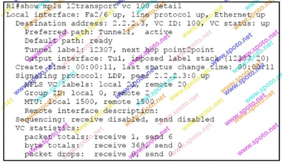


Refer to the exhibit. Which statement is true?

A. R1 routes this pseudowire over MPLS TE tunnel 1 with transport label 20.

B. The default route 0.0.0.0/0 is available in the IPv4 routing

C. R1 is using an MPLS TE tunnel for this pseudowire, because the IP path is not available  

D. R1 has preferred-path configured for the pseudowire.

Answer: D

  


## Q94.

Which two conditions can cause unicast flooding? (Choose two)

A. forwarding table overflow

B. recurring TCNs

C. symmetric routing

D. RIB table overflow

E. multiple MAC addresses in the Layer 2 forwarding table

Answer: AB


## Q95.

Which three operations are valid NETCONF operations? (Choose three)

A. set-config

B. get-config

C. rollback

D. get

E. set

F. edit-config

Answer: BDF


## Q96.



Refer to the exhibit. If R1 and R2 cannot establish an OSPF neighbor relationship, which two actions can you take to resolve the problem? (Choose two)

A. Change the PPP authentication to CHAP authentication

B. Change the ip local pool command on R2 to ip local pool pool1 192.168.1.2 1 92.168.1.5

C. Configure R1 to send the username and password on the Dialer 1 interface

D. Configure PPP encapsulation under the R1 virtual-template interface

E. Configure PPP authentication under the R2 GigabitEthernet0/1 interface

Answer: CD


## Q97.

Which two statements are true  about control plane policing?  (Choose two.)

A. Control plane policing will affect only traffic that is destined to the route processor.

B. Access lists that are used in policies for control plane policing must not use the log keyword.

C. Access lists that use the deny rule in control plane policing do not progress to the next class.

D. The log keyword can be used but the log-input keyword must not be used in policing.

Answer: AB


## Q98.



Refer to the exhibit. What happens to a TCP packet that is received on interface GigabitEthernet 0/0/0.100, which has DF bit set to 1 , and packet has a valid destination?

A. The packet is not matched by route-map foo and the DF bit is left as it was

B. The packet is matched by route-map foo and the DF bit is left as it was

C. The packet is matched by route-map foo and the DF bit is set to 0 

D. The packet is not matched by route-map foo and the DF bit is set to 0

Answer: A


## Q99.

You are configuring CoS-to-DSCP mappings with three requirements:

 - COS 1 must be translated into AF13

 - COS 2 must be translated into AF22

 - COS 5 must be translated into EF

Which configuration command can you use to implement the requirements?

A. mls qos map cos-dscp 0 10 18 24 32 46 48 56

B. mls qos map cos-dscp 0 12 18 24 32 46 48 56

C. mls qos map cos-dscp 0 14 20 24 32 46 48 56

D. mls qos map cos-dscp 0 12 18 24 32 40 46 56

Answer: C


## Q100.

Which statement is true about trunking?

A. Cisco switches that run PVST + do not transmit BPDUs on nonnative VLANs when using a dot1 q trunk.

B. DTP only supports autonegotiation on 802.1q and does not support autonegotiation for I SL.

C. DTP is a point-to-point protocol.

D. When removing VLAN 1 from a trunk, management traffic such as CDP is no longer passed in that VLAN.

Answer: C


## Q101.

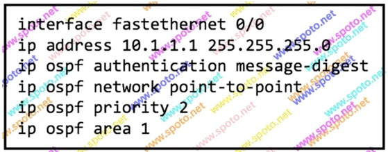


Refer to the exhibit. Which change must you make to this configuration to enable the router to participate in a DR election?

A. Configure the interface to be in area 0

B. Increase the OSPF priority for the interface

C. Remove authentication

D. Change the OSPF network type

Answer: D


## Q102.

What is the reason to send EIGRP SIA reply to a peer?

A. to respond to an SIA query that the router is still waiting on replies from its peers

B. to respond to a reply reporting that the prefix has gone stuck-in-active

C. to respond to a query reporting that the prefix has gone stuck-in-active

D. to respond to an SIA query with the alternative path requested

Answer: A


## Q103.

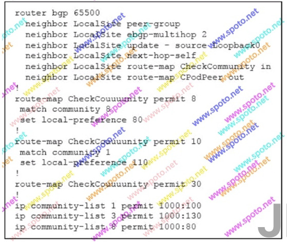


Refer to the exhibit. The router sets local-preference to which option when it receives a BGP route with a community string 1000:130 from a neighbor in the LocalSite peer-group?

A. 80

B. 110

C. 130

D. no setting

E. the default value Correct

Answer: E

  


## Q104.



Refer to the exhibit. What is the meaning of the asterisk (*) in the LSP Seq Num column of this "show isis database" output?

A. The LSP originated on a router with an invalid hold time

B. The LSP originated on a L 1-L2 type router

C. The LSP originated on the router where the command is being executed

D. The LSP originated on a router which is capable of wide metrics

Answer: C

Usefull Link: https://www.cisco.com/c/en/us/td/docs/ios/iproute_isis/command/reference/irs_book/irs_is2.html


## Q105.

Which two statements about  NAT are true? (Choose two)

A. Static NAT supports a one-to-one address mapping

B. Dynamic NAT allows hosts inside a network to use a pool of addresses to access hosts outside the network

C. PAT uses destination port numbers identity address mappings

D. Static NAT release the translated address for use by another device when it is inactive

E. One-to-one mapping denies outside traffic from accessing a n inside host

Answer: AB


## Q106.

Which two statements about IPv6 6to4 tunnels are true? (Choose two)

A. Sites us e addresses from the 2002::/16 prefix

B. Sites use addresses from link-local scope

C. They are point-to-multipoint tunnels

D. They are point-to-point tunnels

E. They rely o n GRE encapsulation

Answer: AC


## Q107.

Which two EtherChannel modes can create an LACP EtherChannel? (Choose two)

A. on

B. active

C. passive

D. auto

E. desirable

Answer: BC

 


## Q108.

Which trunking configuration between two Cisco switches can cause a security risk?

A. configuring different native VLANs on the switches

B. configuring different trunk modes on the switches

C. configuring mismatched VLANs on the trunk

D. disabling DTP on the trunk ports

E. configuring incorrect channel-groups on the switches

Answer: A


## Q109.

Which  two statements about  OSPF route filtering are true? (Choose two)

A. It can be based on the source router ID.

B. It can be based on the external route tag.

C. It affects LSA flooding.

D. It can be based on the as-path.

E. It can be based on distance.

Answer: AB


## Q110.

Which set of commands conditionally advertises 172.16.0.0/24 as long as 1 0.1 0.1 0.1 0/32 is in the routing table?

Answer: B


## Q111.

Which  option  describes how the IP  address is assigned when you configure a Layer 3  EtherChannel interface?

A. You must assign the IP address to the tunnel interface.

B. The last IP address added to the EtherChannel is used automatically.

C. You must assign the IP address to a port channel logical interface.

D. The first IP address added to the EtherChannel is used automatically.

Answer: C


## Q112.

A network engineer implements ISIS for IPv6 and then discovers that IS IS adjacencies are going down. Which action can be taken to fix this problem?

A. Enable multitopology on the IS IS domain

B. Configure link local 1Pv6 addresses on ISIS interfaces

C. Change the is-type on all lSIS routers to level-2-only

D. Enable ISIS for 1Pv6 on loopback interfaces

Answer: D


## Q113.

Which statement about Cisco Express Forwarding are true?

A. The FIB table resides on the route processor and the adjacency table resides on the line cards when Cisco Express Forwarding is enabled.

B. The FIB table and the adjacency table reside on the line cards when Cisco Express Forwarding is enabled.

C. Layer 2 next-hop address information is maintained in the adjacency table.

D. Layer 2 next-hop address information is maintained in the FIB table.

Answer: C


## Q114.

For which reason can two OSPF neighbor routers on the same LAN segment be stuck in the two-way state?

A. The two routers have different MTUs on the interface.

B. The two routers are configured with different priorities.

C. The interface priority is set to zero on both routers.

D. Both routers have the same OSPF router ID. Correct

Answer: C

  


## Q115.

Which two statements about TCP tail  drop are true? (Choose two)

A. It increases the congestion window after each acknowledgement

B. It uses bandwidth efficiently along the entire link

C. It causes TCP flows to be dropped at different intervals

D. It decreases the congestion window after each acknowledgement

E. It causes TCP global synchronization

Answer: CE


## Q116.

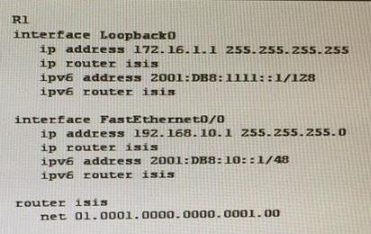


Refer to the exhibit. The route-map wan2site is being used for redistributing BGP routes into the eigrp 28 process. Which option best describes the resulting redistribution of routes?

A. policy routing matches 0 packets means that there are no matches and no routes are being redistributed

B. all routes are being redistributed with a metric and a tag

C. The deny sequence 5 is preventing any routes from and a tag

D. A default routes is being redistributed with a metric and a tag

Answer: C


## Q117.

Which options is the implicit access rule for IPv6 ACLs?

A. permit all

B. permit neighbor discovery, deny everything else

C. deny all

D. permit all l CMP, deny everything else

Answer: B


## Q118.

Which technology does Cisco PfR use to collect passive monitoring statics?

A. NBAR

B. SNMP

C. Syslog

D. NetFlow

Answer: D


## Q119.

You are backing up a server with a 1 Gbps link and a latency of 2 ms. Which two statements about the backup are true? (Choose two.)

A. The bandwidth delay product is 2 Mb.

B. The default TCP send window size is the limiting factor.

C. The default TCP receive window size is the limiting factor.

D. The bandwidth delay product is 500 Mb.

E. The bandwidth delay product is 50 Mb.

Answer: AC


## Q120.

What is a requirement for BFD static route support?

A. CEF must be configured on all routers that will carry traffic.

B. BFD must be configured on all Ethernet, virtual-template, and dialer interfaces that will carry traffic.

C. All routers that will carry traffic must have the same software version.

D. All routers that will carry traffic must be the same model.

Answer: A


## Q121.

Which two options are two problems that can occur with this configuration (Choose two)

A. The MPLS path from R1 to R5 becomes unreachable.

B. R1 and R5 are unable to establish an LDP relationship.

C. The label for the R1 loopback address is filtered from other MPLS routers.

D. The label for the RS loopback address is filtered from other MPLS routers.

E. MPLS traffic from R1 to R5 takes a suboptimal path.

Answer: AD


## Q122.

Which value does EIGRP use to determine the metric for a summary address?

A. The average of the component metrics

B. A default fixed value

C. The lowest metric among the component routes

D. The highest metric among the component routes

Answer: C

   


## Q123.

Which enhancement does IGMP version 3 offer over IGMP version 2?

A. support for Source Specific Multicast

B. a mechanism to decrease leave latency

C. authentication of multicast streams

D. backward compatibility with IGMP version 1

Answer: A

   


## Q124.

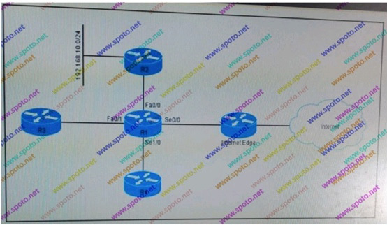


Refer to the exhibit. If R1 uses EIGRP to learn route 192. 1 B8.1 0.0/24 from R2, which interface on R1 uses split horizon for route 192.168.10.0/24?

A. Se0/0

B. Fa0/0

C. Se1/0

D. Fa0/1

Answer: B


## Q125.

Which option describes the characteristics of a public Infrastructure as a Service cloud service model?

A. It is a way of delivering cloud-computing infrastructure (servers, storage, network, and operating systems) as an on-demand service.

B. It is a cloud-computing platform that facilitates the creation of web applications without the need to maintain the supporting software applications.

C. It is a cloud service where the underlying hardware is managed by the cloud service provider.

D. It is a cloud-computing platform that facilitates the creation of web applications without the need to maintain the supporting software operating systems

Answer: A


## Q126.

Which attribute is not part of the BGP extended community when a PE creates a VPN-IPv4 route while running OSPF between PE-CE?

A. OSPF domain identifier

B. OSPF route type

C. OSPF router ID

D. MED

E. OSPF network type

Answer: E

  


## Q127.

Which two roles are used by devices for building multicast trees using bidirectional PIM? (Choose two)

A. Pruning Router

B. Designated Forwarder

C. Rendezvous Point

D. Mapping Agent

E. Candidate Rendezvous Point

F. Bootstrap Router

Answer: BC


## Q128.

Which IPv4 feature can limit indiscriminate flooding of multicast traffic on a VLAN?

A. IGMP Filtering

B. IGMP Snooping

C. MLD Filtering

D. PIM Snooping

Answer: B


## Q129.

What are the minimum requirements for Cisco PfR to provide routing control?

A. one master controller, two border routers, two internal interfaces, and two external int erfaces.

B. one master controller, one border router, one internal interface, and two external interfaces.

C. one master controller, two border router, one internal interface, and one external interface.

D. one master controller, one border router, two internal interfaces, and one external interface.

E. two master controllers, one border router, one internal interface, and one external interface

Answer: B


## Q130.

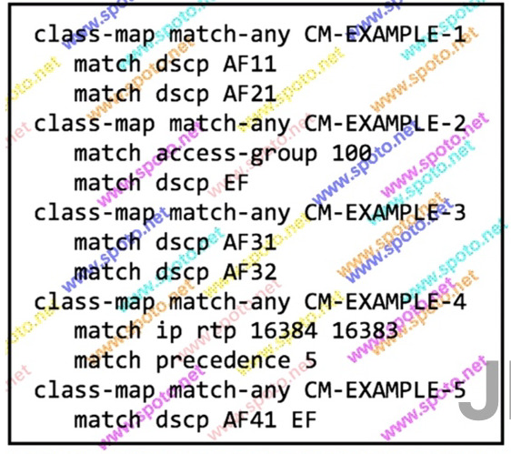


Refer to the exhibit. If you apply this configuration to a device on your network, which class map cannot match traffic?

A. CM-EXAMPLE-1

B. CM-EXAMPLE-2

C. CM-EXAMPLE-3

D. CM-EXAMPLE-4

E. CM-EXAMPLE-5

Answer : C


## Q131.

Which three protocols are permitted by IEEE 802.1x port based authentication before the client is successfully authenticated by the R ADIUS server? (Choose three)

A. IP

B. CDP

C. EAPOL

D. STP

E. TCP

F. BOOTP

Answer: BCD


## Q132.

On which three  options can Cisco PfR base its traffic routing?  (Choose three. )

A. Time of day

B. An access list with permit or deny statements

C. Load-balancing requirements

D. Network performance

E. User-defined link capacity thresholds

F. Router 10S version

Answer: CDE


## Q133.



Refer to the exhibit. If a console port is configured as shown, which response is displayed when you connect to the console port?

A. a blinking cursor

B. the message "Authorized users only"

C. the username prompt

D. three username name prompts followed by a timeout message

E. the message "Connection refused"

Answer: A

  


## Q134.

Which  two statements about  Metro  Ethernet services are true? (Choose two.)

A. EPL is a point-to-point service from one customer site to another across an MPLS backbone.

B. EVPL is a multipoint service that emulates a LAN over an MPL S backbone.

C. EPLAN is a multipoint service that emulates a LAN over an MPLS backbone.

D. EVPL is a point-to-point service from one customer site to another across an MPLS backbone.

E. ELAN is a point-to-point service from one customer site to another across an MPL S backbone.

F. EVPL is a multipoint service with a root node that is suitable for multicast services

Answer: AC


## Q135.

Which two options are restrictions of BGP ORF? (Choose two)

A. It can be used only with I Pv4 multicast.

B. It requires access lists to match routes.

C. It can be used only with eBGP.

D. Multicast is not supportHd.

E. It can be used only with iBGP

Answer: CD


## Q136.

Which way to influence path selection with EIGRP is preferred?

A. changing the bandwidth, because it does not have any impact on other router features

B. changing the b andwidth, because that is what Cisco recommends.

C. changing the bandwidth, because it must be done only on one interface along the path

D. changing the delay, even if it must be done on multiple interfaces

Answer: D


## Q137.

What are two features that distance vector routing protocols can use to address the count to infinity problem?  (Choose two.)

A. split horizon

B. adjacency dead timers

C. route tagging

D. triggered updates

E. route poisoning

Answer: AE


## Q138.

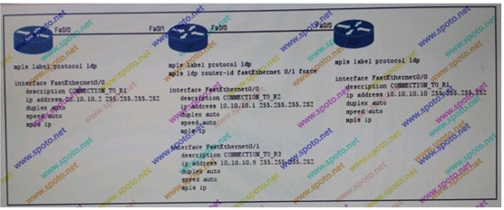


Refer to the exhibit. Between which routers is an LOP session established?

A. R1 and R3

B. R1, R2 and R3

C. R2 and R3

D. R1 and R2

Answer: D


## Q139.

Which two items must be defined to capture packet data with the Embedded Packet Capture feature? (Choose two.)

A. the capture rate

B. the capture point

C. the capture buffer

D. the buffer memory size

E. the capture filter

F . the capture file export location

Answer: BC


## Q140.

How does MSTP maintain compatibility with RSTP?

A. RSTP implements a TTL that is compatible with the MSTP max age timer.

B. MSTP supports five port states in the same way as RSTP.

C. MSTP sends all spanning-tree information in one BPDU.

D. RSTP encodes region information from an MSTP BPDU into a single instance.

Answer: C


## Q141.

What are IPv6 addresses of the form fc00::/7 known as?

A. unique local addresses

B. transition addresses for 6to4

C. link-local addresses

D. multicast RP addresses

Answer: A


## Q142.

Which two statements about route summarization are true? (Choose two) 

A. EIGRP le arned routes are automatically summarized

B. Routes are automatically summarized to their classful boundary with OSPF

C. When a packet is routed to a destination, the router chooses the most specific prefix from the routing table

D. It is recommended for use on discontiguous networks

E. BGP sends both specific and aggregate routes unless the keyword "summary-only" i:s configured

Answer:  CE

 


## Q143.



Refer to the exhibit. Which statement is true?

A. The output shows an IPv6 multicast address with link-local scope.

B. The output shows an IPv6 multicast address that is used for unique local sources only.

C. The output shows an IPv6 multicast address that can be used for BIDIR-PIM only.

D. The output shows an IPv6 multicast address with embedded RP.

Answer D


## Q144.

For what reason might you choose to use an SVTI interface instead of a crypto map on a tunnel interface?

A. SVTIs support dynamic routing protocols without GRE headers.

B. SVTIs can support multiple IPSec SAs.

C. SVTIs can carry non-IP traffic.

D. SVTIs support CEF-switched traffic shaping.

Answer: A


## Q145.

Which three statements about bridge assurance are true?  (Choose three.)

A. Bridge assurance must be enabled on both ends of a link.

B. Bridge assurance can be enabled on one end of a link or on both ends.

C. Bridge assurance is enabled on STP point-to-point links only.

D. Bridge assurance is enabled on STP multipoint links only.

E. If a bridge assurance port fails to receive a BPDU after a timeout, the port is put into a blocking state.

F. If a bridge assurance port fails to receive a BPDU after a timeout, the port is put into an error disabled state

Answer: ACE


## Q146.

What is the purpose of the YANG language?

A. YANG is a data modeling language used to describe device configuration and operational data

B. YANG is a scripting language used to program device configuration and operational data

C. YANG is a markup language used to encode device Configuration and operational data

D. YANG is a communications protocol for sending device configuration and operational data

Answer: A


## Q147.

Which two discovery mechanism does LDP support? (Choose two.)

A. strict

B. extended

C. loose

D. targeted

E. basic

Answer: BE


## Q148.

Which two statements about IGPs are true? (Choose two)

A. RIPv2 and OSPF are distance vector protocols.

B. OSPF and E IGRP have high resource usage.

C. IS-IS and E IGRP are link-state protocols.

D. OSPF and IS-IS are classless protocols.

E. RIPv2 and E IGRP support VLSM.

F. RIPv2 and IS-IS calculate the metric of a link based on the bandwidth of a link.

Answer: DE


## Q149.

Which command can you enter to prevent a router from displaying Telnet connection mesi;ages on the terminal?

A.	service telnet-zeroidle

B.	ip telnet hidden hostname

C.	ip telnet hidden address

D.	no ip domain-lookup

E.	ip telnet quiet

Answer: E


## Q150.

How is the MRU for a mutilink bundle determined?

A. It is negotiated by NCP

B. It is negotiated by LCP

C. It is manually configured on the multilink bundle.

D. It is negotiated by IPCP

E. It is manually configured on all physical interfaces of a multilink bundle

Answer: B


## Q151.

When you implement the EIGRP add-paths feature, which configuration can cause routing issues on a DMVPN circuit?

A. disabling ECMP mode under the EIGRP process.

B. disabling automatic summarization

C. enabling next-hop-self under the EIGRP process.

D. enabling synchronization under the E IGRP process

E. disabling the default variance under the EIGRP process

F. disabling NHRP when deploying EIGRP over DMVPN

Answer: E


## Q152.

Ping and Traceroute extended options  are very useful. What is the difference between using the Record option with the ping  command vs. the traceroute command?

A. The record option is not supported with the ping command

B. The record option is not supported with the traceroute command

C. When leveraged with the ping command, the Record option of this command not only informs you of the hops that the echo request (ping) went through to get the destination, but it also informs you of the hops it visited on the return path

D. When leveraged with the traceroute command, the Record option of this command not only informs you of the hops that the echo request (ping) went through to get the destination, but it also informs you of the hops it visited on the return path

Answer: C


## Q153.

Which two statements about SSM are true? (Choose two)

A. It is designed to support many-to-many applications within a P IM domain.

C B. It requires IGMPv3 for source filtering.

D C. It uses (*, G) multicast routing entries to make forwarding decisions.

C D. It can work in conjunction with the ISM service.

D E. Its application and protocols use address 233.0.0.0 ?233.255.255.255

Answer: BD


## Q154.

Which condition must be satisfied before a Cisco router running RIP can poison a route?

A. The invalid timer must expire.

B. The hold down timer must expire.

C. The flush timer must expire.

D. The flush timer must reach 240 seconds.

E. The metric must equal·16

Answer: A


## Q155.

Which authentication types does OSPF support?

A. null(or no authentication) and clear text

B. MD5 only

C. MD5 and clear text

D. null(or no authentication), clear text, and MDS

E. clear text only

Answer: D


## Q156.

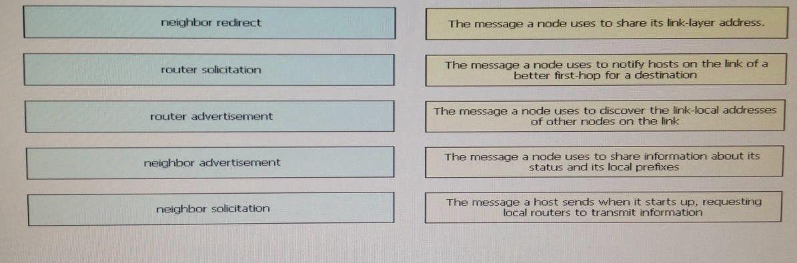


Refer to the exhibit. Which two options are two benefits of this configuration? (Choose two) 

A. increased security

B. redundancy

C. reduced jitter

D. reduced latency

E. load sharing

Answer: BE


## Q157.

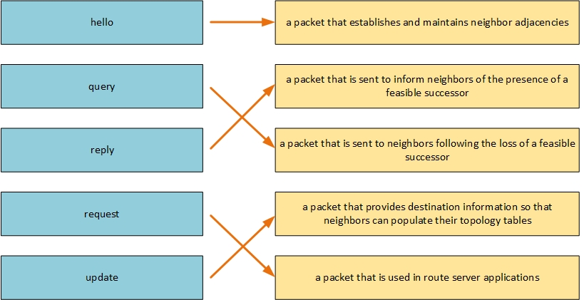


Refer to the exhibit. Which AS paths are matched by this access list?

A. the origin AS 64496 only

B. the origin AS 64496 and any ASs after AS 64496

C. the directly attached AS 64496 and any ASs directly attached to AS 64496

D. the directly attached AS 64496 and any longer AS paths

Answer: C


## Q158.

Which IS-IS network type can operate in the absence of a DIS?

A. point-to-multipoint

B. Ethernet

C. NBMA

D. p oint-point

Answer: D


## Q159. 

What is the correct binary equivalent of DSCP value AF41?

A. 101001

B. 100001

C. 100010

D. 001010

Answer: C


## Q160.

Which two statements about IPv6 RA guard are true? (Choose two)

A. It blocks unauthorized ICMPv6 Type 134 packets

B. It supports host mode and router mode

C. It provides security for tunneled IPv6 traffic

D. It is supported in the ingress and egress directions

E. It blocks unauthorized ICMPv6 Type 133 packets

Answer: AB


## Q161.

Which measure does ISIS use to avoid sending traffic with a wrong MTU configuration?

A. IS IS does not protect from MTU mismatch.

B. MTU value is communicated in IS IS Sequence Numbetr PDUs (SNP), and IS IS adjacency is not established if an MTU mismatch is detected.

C. ISIS uses path MTU discovery as specified in RFC 1063.

D. ISIS uses padding of hello packets to full MTU.

Answer: D


## Q162.

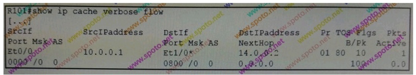


Refer to the exhibit. What is the PHB class on this flow?

A. EF

B. none

C. AF21

D. CS4

Answer: D

Explanation: TOS 80 Hex in decimal is 128, convert TOS to decimal divide by 4 = 32, decimal 32 = CS4

## Q163.

Which  two statements about  LDP are true? (Choose two)

A. LDP sessions are established between LSRs

B. It enables LSRs to communicate label bindings

C. It sends hello messages over TCP

D. It uses a 16-byte identifier

E. It supports only directed-connected neighbors

F. It sends hello messages as UDP packets via unicast

Answer: AB


## Q164.

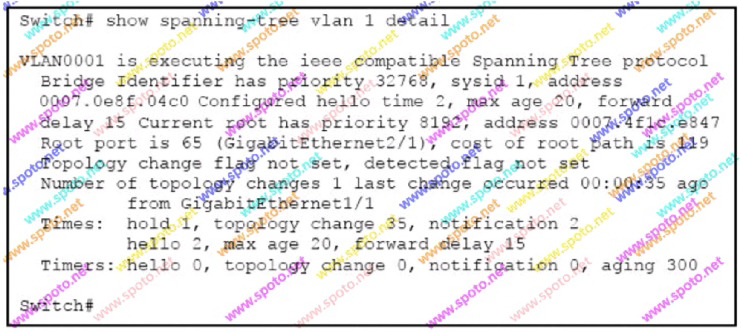


Refer to the exhibit. Which two statements about the output are true? (Choose two.)

A. Setting the priority of this switch to O for VLAN 1 would cause it to become the new root.

B. This switch is the root bridge for VLAN1

C. Spanning-tree PortFast should not be enabled on GigabitEthernet2/1 

D. 802.1w spanning tree is being used 0

E. Spanning tree PortFast is enabled on GigabitEthernet1/1

Answer: AC


## Q165.

Which option describes how a VTPv3 device responds when it detects a VTPv2 device on a trunk port?

A. It sends VTPv3 packets only.

B. It sends VTPv2 packets only.

C. It sends VTPv3 and VTPv2 packets.

D. It sends a special packet that contains VTPv3 and VTPv2 packet information.

Answer: C


## Q166.

Which three statements about IS-IS are true? (Choose three.)

A. IS-IS can be used only in the service provider network.

B. IS-IS can be used to route both IP and CLNP.

C. IS-IS has three different levels of authentication: interface level, process level, and domain level.

D. IS-IS is an IETF standard.

E. IS-IS has the capability to provide address summarization between areas.

Answer: BCE (Suggested B,C,D)

Usefull link: https://www.cisco.com/c/en/us/support/docs/ip/integrated-intermediate-system-to-intermediate-system-is-is/13792-isis-authent.html


## Q167.

Which two statements about OSPFv3 are true? (Choose two.)

A. It supports unicast address families for 1Pv4 and 1Pv6.

B. It supports unicast address families for 1Pv6 only.

C. It supports only one address family per instance.

D. It supports the use of a cluster ID for loop prevention.

E. It supports multicast address families for 1Pv4 and 1Pv6.

F. It supports multicast address families for 1Pv6 only

Answer: AC


## Q168.

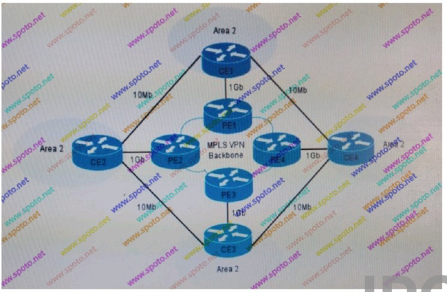


Refer to the exhibit. Your network uses an MPLS VPN backbone with OSPF routing between all PE and CE routers and one the 10Mb backup links between the CE routers. 

You notice that data between CE1 and CE3 is flowing over the backup links instead of the higher bandwidth MPLS VPN backbone even when the backbone is up.

What is the most likely explanation for this behavior?

A. The devices are preferentially using inter-area routing

B. The devices are preferentially using lower-cost routing

C. The MPLS VPN backbone is using external BGP instead of OSPF

D. The devices are preferentially using intra-area routing

E. The network is using sha m links on the MPLS VPN backbone

Answer: D


## Q169.

Which traffic-monitoring class allows Cisco PfR to run on platforms with limited border router functionality?

A. active monitoring

B. fast failover monitoring

C. passive monitoring

D. combined monitoring

E. special monitoring

Answer: B (Suggested E)

Usefull Link: https://www.cisco.com/c/en/us/td/docs/ios-xml/ios/pfr/configuration/15-mt/pfr-15-mt-book/pfr-understand.pdf


## Q170.

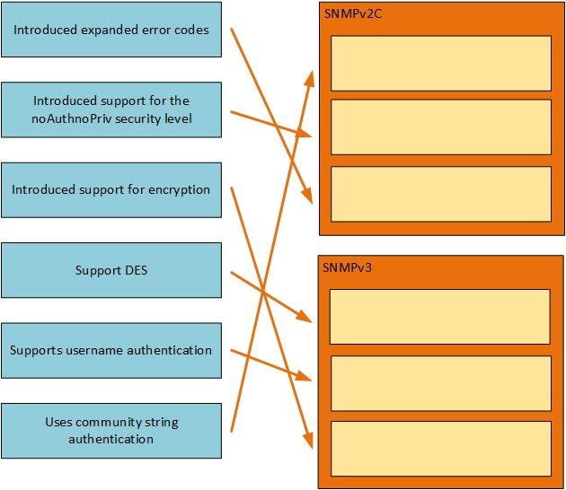


Refer to the exhibit.  Which statement is true?

A. The Cisco PfR state is UP; however, the external interface Eth0/1 of border router 10.1.1.1 has exceeded the maximum available bandwidth threshold.

B. The Cisco PfR state is UP; however, an issue is preventing the border router from establishing a TCP session to the master controller.

C. The Cisco PfR state is UP and is able to monitor traffic flows; however MD5 authentication has not been successful between the master controller and the border routers

D. The Cisco PfR State is UP; however, the receive capacity was not configured for inbound traffic

E. The Cisco PfR state is UP, and the link utilization out-of-policy is set to 90 percent for traffic exiting the external links

Answer: E


## Q171.

What are the two EEM event subscribers? (Choose two)

A. CLI

B. script

C. applet

D. none

E. syslog

Answer: BC


## Q172.



Refer to the exhibit. What is the maximum size of a packet that can be sent successfully from R3 to 10.1.2.1 without enabling fragmentation?

A. 1490 bytes

B. i480 bytes

C. 1501 bytes

D. 1479 bytes

E. 1521 bytes

F. 1500 bytes

Answer: A


## Q173.

Which two statements about GLBP are true ? (Choose  two.)

A. Each GLBP group supports up 4 to MAC addresses.

B. It uses Hello, Request, and Reply packet types.

C. It allows members to elect up to two gateways as the AVG.

D. It communicates to multicast address 224.0.0.18

E. It supports stateful switchover

Answer: AB

Usefull Link: https://www.cisco.com/c/en/us/td/docs/ios-xml/ios/ipapp_fhrp/configuration/xe-3s/fhp-xe-3s-book/fhp-glbp.pdf


## Q174.

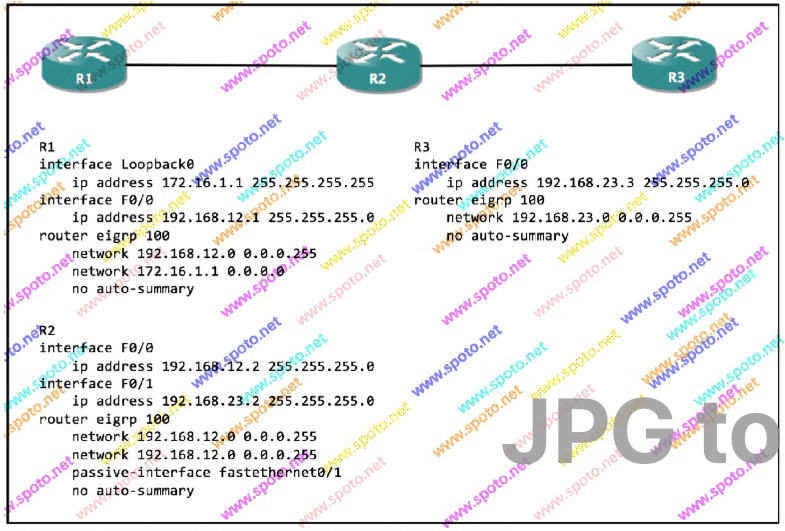


Refer to the exhibit. Which of this configuration is true?

A. R1 and R2 from an adjacency.

B. R2 interface F0/1 accepts Hello packets from R3.

C. R2 and R 3 form an adjacency.

D. R3 advertises the 192.168.12.0/24 network.

E. R2 interface F0/1 accepts routing updates from R3.

Answer: A

   


## Q175.

Which command can you enter to configure a Cisco router running OSPF to propagate the static default route 0.0.0.0 0.0.0.0 172.31.15.1 within the OSPF process?

A.	default-information originate

B.	redistribute static subnets

C.	redistribute static metric 1 subnets

D.	redistribute static

Answer: A


## Q176.

Which two statements about the passive-interface command EIGRP  are true ? (Choose two)

A. It configures the device to advertise only connected interfaces to neighbors with EIGRP.

B. It configures the interface to use unicast messages to establish EIGRP neighbor relationships.

C. It allows incoming routing updates to be received but disables outgoing routing updates.

D. It disables processing of incoming hello messages.

E. If it is enabled globally under EIGRP on the device, it can be disabled for individual interfaces to allow those interfaces to remain active

Answer: DE


## Q177.

Which two statements are true about IS- IS? (Choose two.)

A. IS-IS DIS election is nondeterministic.

B. IS-IS SPF calculation is performed in three phases.

C. IS-IS works over the data link layer, which does not provide for fragmentation and reassembly.

D. IS-IS can never be routed beyond the immediate next hop.

Answer: CD


## Q178.



Refer to the exhibit. Which two additional configuration lines must you add so that the device will capture data packets using Embedded Packet Capture (EPC)? (Choose two.)

A. monitor capture buffer BUFFER_CAPTURE filter access-list CAPTURE_FILTER 

B. monitor capture point ip process-switched POINT_CAPTURE from-us

C. monitor capture point associate POINT_CAPTURE BUFFER_CAPTURE

D. monitor capture buffer BUFFER_CAPTURE limit allow-nth-pak 100 

E. monitor capture point start all

Answer: CE


## Q179.

Which two statements about logging are true? (Choose two.)

A. Logs can be displayed on the console or on a remote terminal.

B. The mnemonic can refer to a hardware device, a protocol, or a software module.

C. Log messages include a mnemonic that describes the message.

D. A log message can include both uptime and the datetime timestamps.

E . When you enable sequence numbers, the datetime timestamp is disabled automatically by default.

F. A log message's facility value indicates the hardware on which the log message was generated

Answer: CE (Suggested A,C)


## Q180.

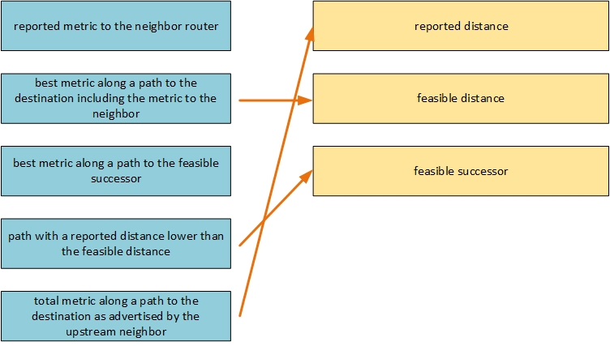


Refer to the exhibit. Which three statements correctly describe the route reflector's behavior? (Choose three.)

A. The route reflector will reflect routes from R1 to R2

B. The route reflector will not reflect routes from R1 to R2

C. The route reflector will reflect routes from R1 to R3

D. The route reflector will not reflect routes from R1 to R3

E. The route reflector will reflect routes from R3 to R1

F. The route reflector will not reflect routes from R3 to R1

Answer: ACE (Suggested B,C,E)

Usefull Link: https://www.cisco.com/c/m/en_us/techdoc/dc/reference/cli/n5k/commands/client-to-client-reflection.html
https://tools.ietf.org/html/rfc4456#section-6

## Q181.

Which IS-IS router type can have neighbors in any area?

A. Level 1/Level 2 intermediate System only

B. Both Level 1 Intermediate Systems and Level 2 Intermediate Systems

C. Level 2 Intermediate System only

D. Both Level 1/Level 2 Intermediate Systems and Level 2 Intermediate Systems

E. Level 1 Intermediate System only

Answer: A


## Q182.



Refer to the exhibit. When you apply this configuration to the router, which effect is true?

A. The router multicasts hello packets via interface F0/0.

B. The router sends hello packets to neighbor 192.168.35.3 via unicast

C. The router broadcasts hello packets via interface F0/0.

D. The router stops sending hello packets to neighbor 192.168.35.3

Answer: D


## Q183.

What characteristic of OSPFv3  LSAs enables support for prefix suppression?

A. Router-LSAs and Network-LSAs do not contain topology information

B. Router LSAs and Network-LSAs do not contain prefix information

C. Router-LSAs and Network-LSAs are flooded into the entire OSPF domain

D. Router-LSAs and Network-LSAs are flooded only on the local link

Answer: B


## Q184.

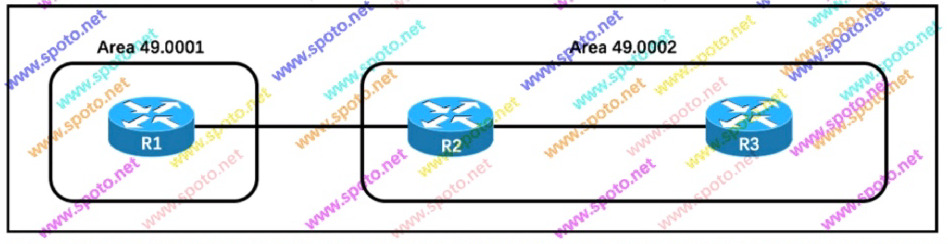


Refer to the exhibit. The ISIS router type settings on all routers are left at the default value. Which two statements correctly describe the IS IS adjacencies that will form? (Choose two.)

A. The R1 to R2 adjacency will be L2 only

B. The R1 to R3 adjacency will be L1 and L2

C. The R1 to R2 adjacency will be L1 and L2

D. The R2 to R3 adjacency will be L1 and L2

E. The R2 to R3 adjacency will be L1 only

Answer: AD


## Q185.

Which statement is true when using a VLAN ID from the extended VLAN range (1006-4094)?

A. VLANs in the extended VLAN range can be used with VTPv2 in either client or server mode.

B. VLANs in the extended VLAN range can only be used as private VLANs.

C. STP is disabled by default on extended-range VLANs.

D. VLANs in the extended VLAN range cannot be pruned.

Answer: D


## Q186.



Refer to the exhibit. Edge 1 and Edge 2 are running OTV across the transport Network. When an Ethernet frame destined for MAC address BB arrives at Edge 1, how is the frame encapsulated?

A. Edge 1 encapsulates the frame in an OTV packet after removing the layer 2 preamble and FCS

B. Edge 1 encapsulates the frame in an OTV packet preserving the layer 2 preamble and FCS

C. Edge 1 encapsulates the frame in an OTV packet after recalculating the FCS

D. Edge 1 encapsulates the frame in an OTV after updating the layer 2 preamble with bridge 2's MAC address

Answer: B


## Q187.

Which two statements correctly describe MLD snooping? (Choose two.)

A. It is independent of IGMP snooping

B. It can be disabled globally and then enabled on individual VLANs

C. Global configurations override VLAN configurations

D. It can be enabled on VLANs 1 through 1001 only

E. VLAN query values override global values

Answer: DE

## D&D 1.

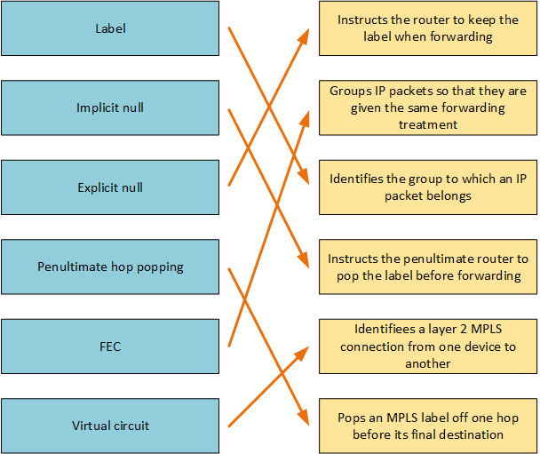

## D&D 2.


## D&D 3.


## D&D 4.


## D&D 5.


## D&D 6.

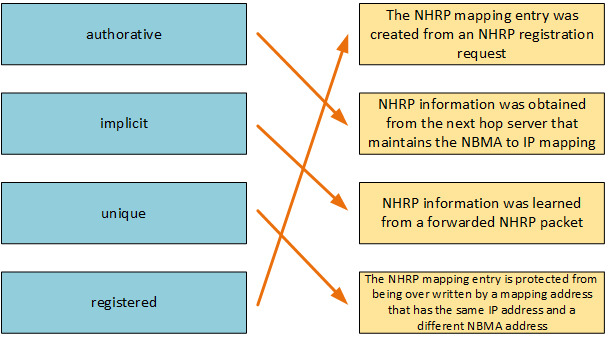

## D&D 7.

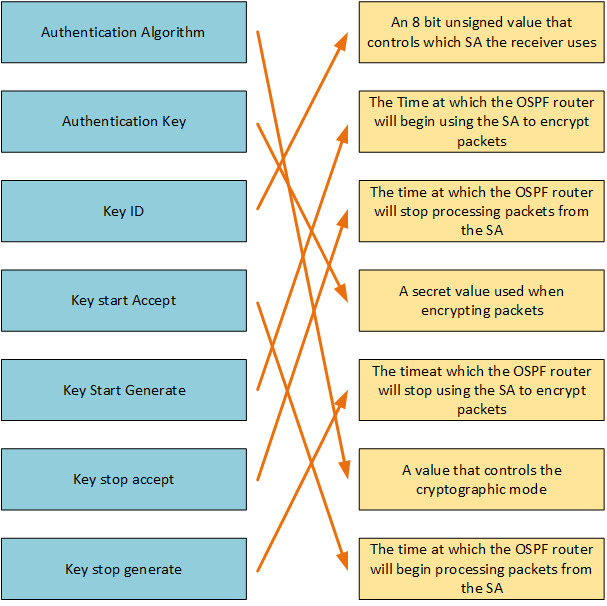

## D&D 8.


## D&D 9.

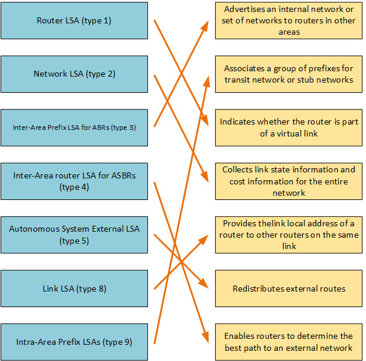

## D&D 10.

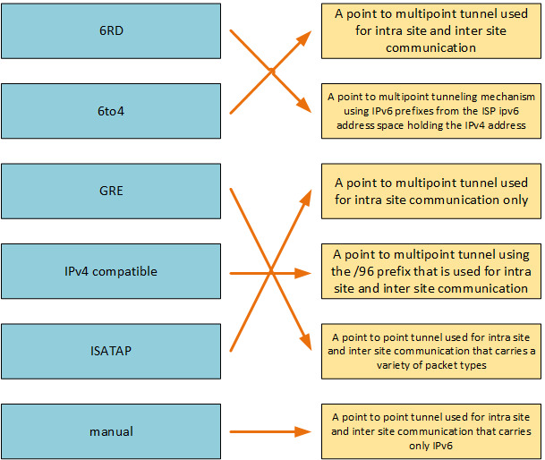

## D&D 11.

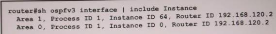

## D&D 12.


## D&D 13.


## D&D 14.


## D&D 15.

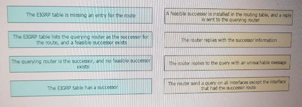

## D&D 16.


## D&D 17.


## D&D 18.

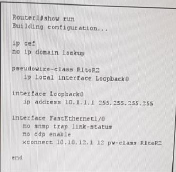
